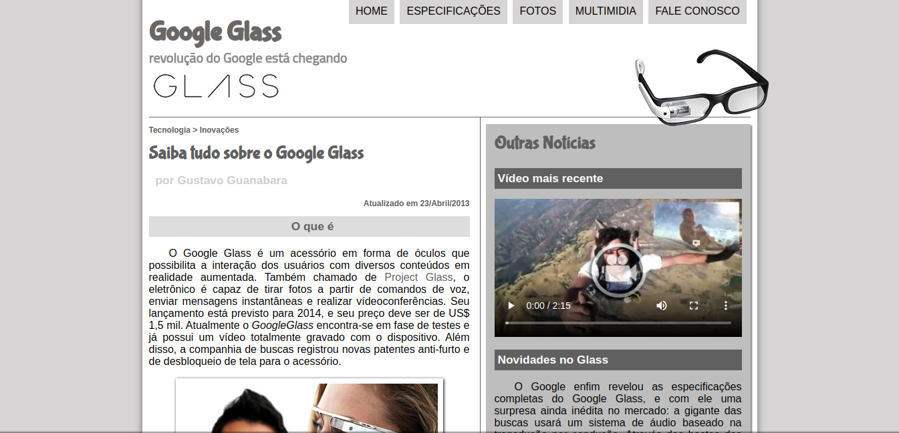
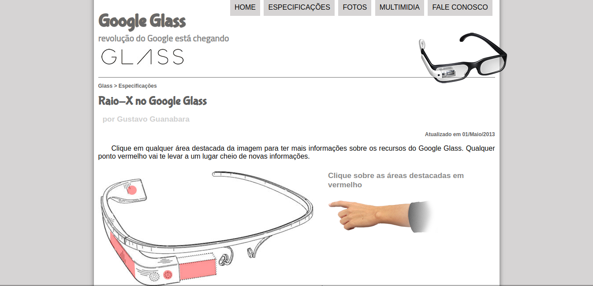
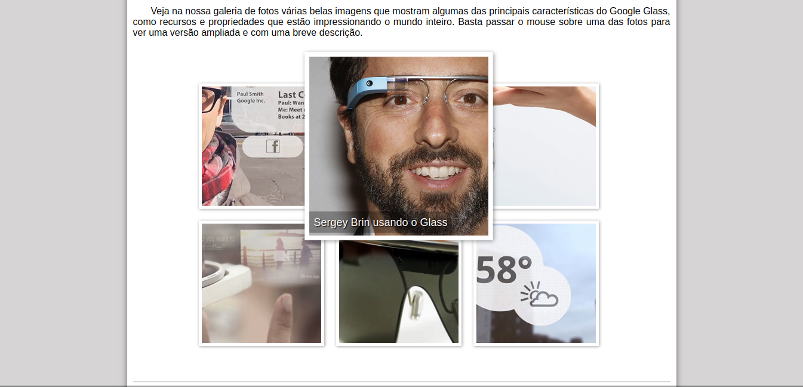
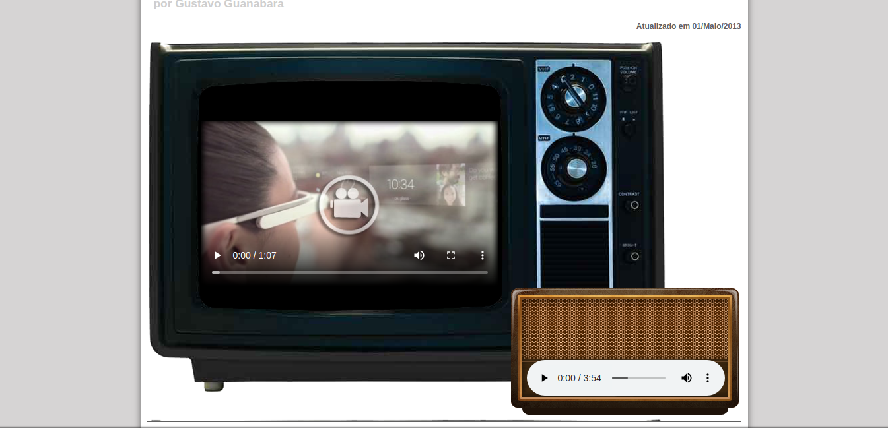
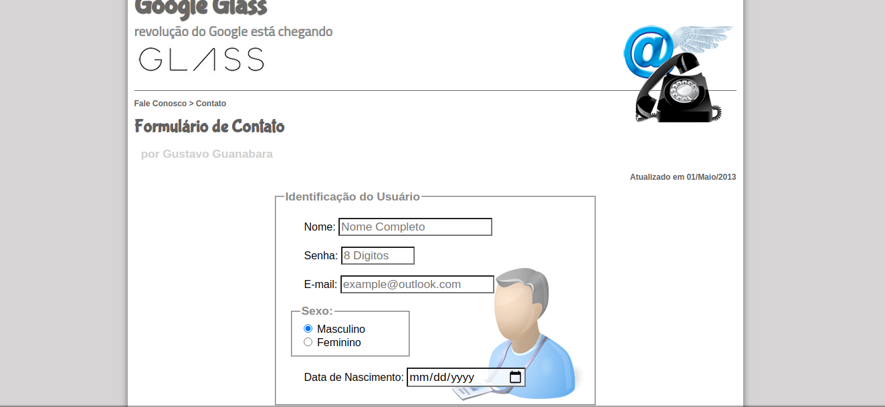

<h1 align="center">Google Glass</h1>
<p align="center">
  
  
  
  
  
  

</p>

<p align="center">
  Website antigo da Google Glass desenvolvido durante o curso de <a href="https://www.cursoemvideo.com/course/html5/">HTML e CSS - Curso em Vídeo</a>.
</p>

<p align="center">
   <a href="#globe_with_meridians-Tecnologias">Tecnologias</a>
  &nbsp;&nbsp;&nbsp;|&nbsp;&nbsp;&nbsp;
  <a href="#wrench-Como-Utilizar">Como Utilizar</a>
  &nbsp;&nbsp;&nbsp;|&nbsp;&nbsp;&nbsp;
  <a href="#heavy_check_mark-About">About</a>
  &nbsp;&nbsp;&nbsp;|&nbsp;&nbsp;&nbsp;
  <a href="#memo-License">License</a> 
</p>
</p>

## :globe_with_meridians: Tecnologias
<p>Projeto desenvolvido com as seguintes tecnologias:</p>

* HTML5
* CSS3
* JavaScript

## :wrench: Como Utilizar

```
#1 - Clone o repositório
$ git clone https://github.com/ale-mouraboni/google-glass.git

#2 - Abra o index.html
```

## :heavy_check_mark: About
<p>Website antigo da Google Glass desenvolvido em HTML, CSS e um pouco de JavaScript. Esse projeto foi desenvolvido durante o curso de <strong>HTML e CSS - Curso em Vídeo</strong>, esse foi o primeiro projeto que desenvolvi da minha carreira como desenvolvedor web.
</br>
Projeto desenvolvido durante o curso de <strong>HTML e CSS - Curso em Vídeo</strong>.
</p>

### Responsive?
[ ] Yes  [x] No

## :memo: License
<p>This project is under the MIT license. See the [LICENSE] for more information.
</p>
